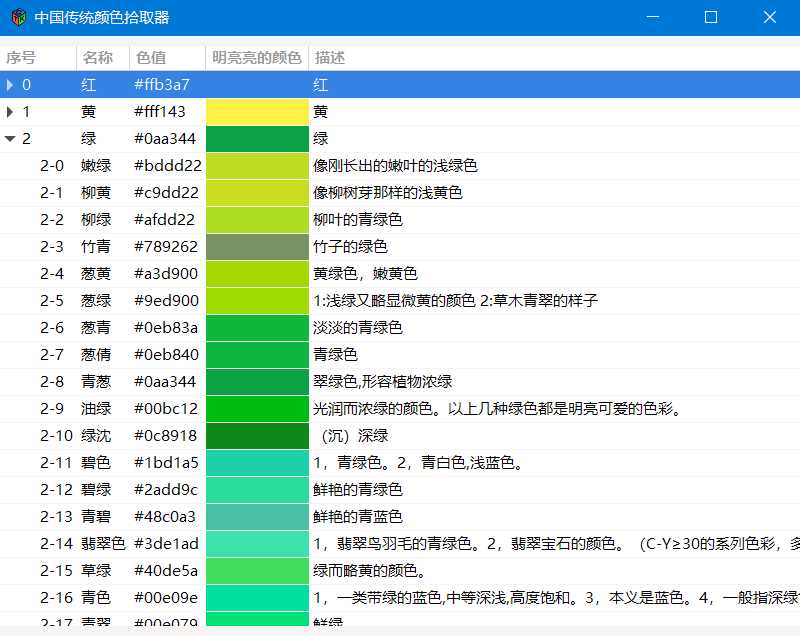
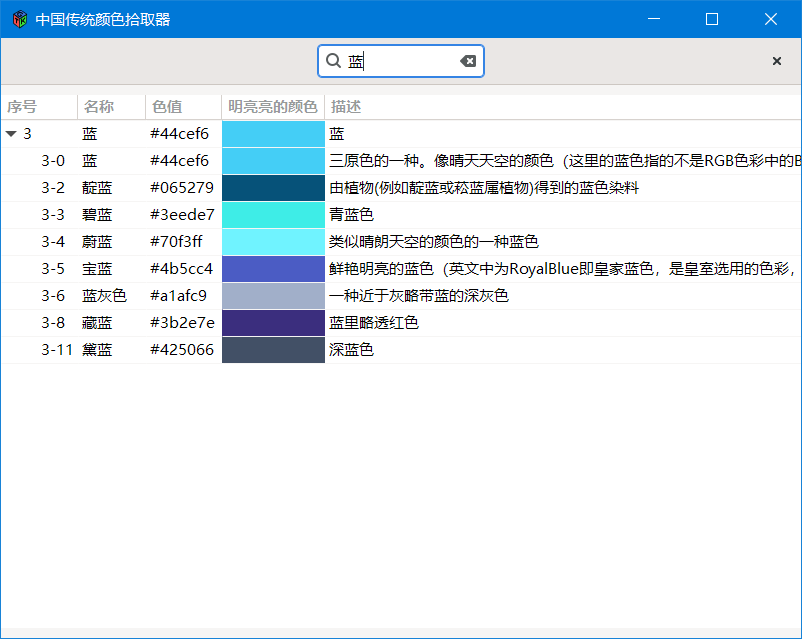
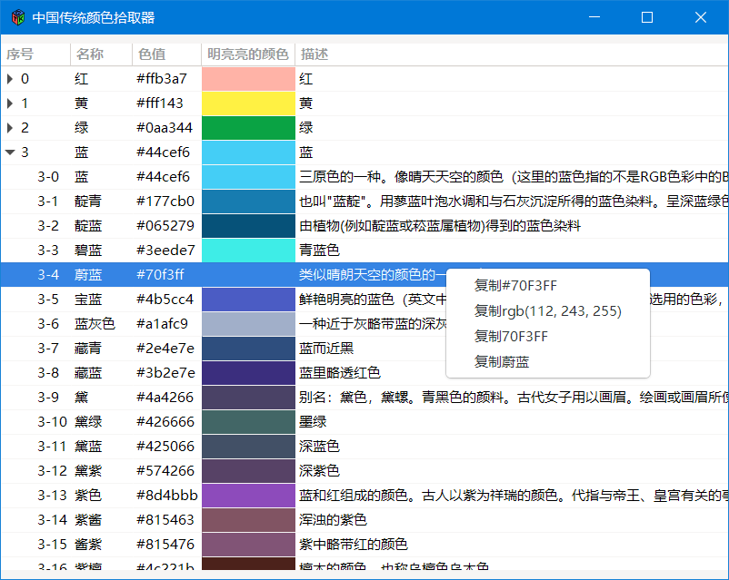

# 中国传统颜色调色板

[中国传统颜色手册](https://colors.ichuantong.cn/)是非常不错的在线颜色拾取网站，但它没有直观的颜色列表，颜色对比较为吃力。之后参考它的[源码](https://github.com/zerosoul/chinese-colors)，找到所有[颜色列表](./data/colors.json)，做成这个调色板拾色器。

# 截图

# 发布协议

AGPL v3
